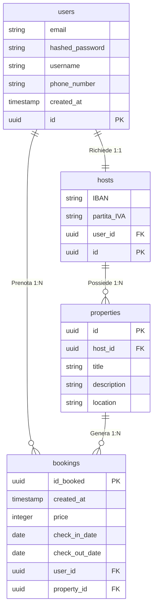

# System Design Architecture: Airbnb Relational Clone 🏠

## Overview
This repository contains the foundational **Relational Database Architecture** for a simplified Airbnb clone. It focuses heavily on **Data Integrity, Cardinality, and Financial Data Safety**, simulating an enterprise-level PostgreSQL environment.

This project was built to demonstrate structural backend engineering skills, specifically modeling complex relationships (1:1, 1:N) and enforcing strict DDL constraints before writing application code.

## 🏗 Architecture & Schema

The database relies on four core entities: `users`, `hosts`, `properties`, and `bookings`.

## 🧠 Engineering Decisions & Best Practices Applied

1. **The "Single Identity" Pattern:**
   Instead of creating separate tables for "Guests" and "Hosts" (which leads to data duplication and sync errors), all accounts reside in `users`. A user becomes an Host only if a corresponding row exists in the `hosts` table (1:1 Relationship enforced by a `UNIQUE` constraint on the Foreign Key).
   
2. **Financial Precision:**
   In the `bookings` transactional table, the `price` is stored as an `INTEGER` (representing cents, e.g., 15000 = €150.00). This eliminates floating-point math inaccuracies (common with `FLOAT` or `DECIMAL` types) at the database level.

3. **Zombie Data Prevention (Cascading):**
   All relationships utilize strict `ON DELETE CASCADE` policies. If a Host profile is deleted, all their associated properties are purged. If a User is deleted, their bookings are automatically cleared to prevent orphan rows from polluting the financial aggregations.

4. **Deterministic UUIDs & Constraint Locks:**
   The schema strictly enforces `UNIQUE` and `NOT NULL` constraints to prevent race conditions during concurrent inserts. Primary Keys are automatically generated via `gen_random_uuid()` to prevent ID predictability.

## 📂 Repository Structure
- `airbnb_schema.sql`: Contains the pure DDL (`CREATE TABLE` statements with all constraints).
- `airbnb_seed.sql`: Contains deterministic test data (Users, Hosts, Properties, Bookings) to simulate real-world aggregations and test SQL `JOIN` performance.